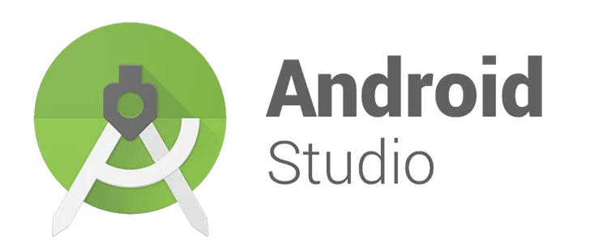
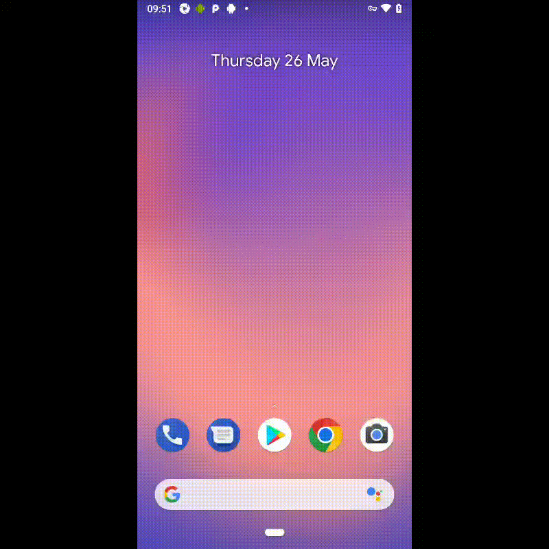
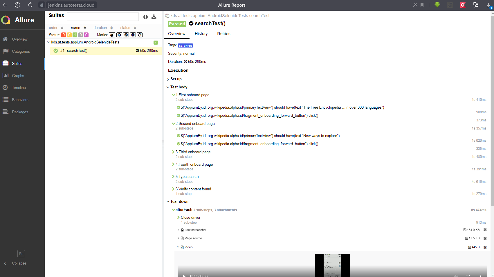
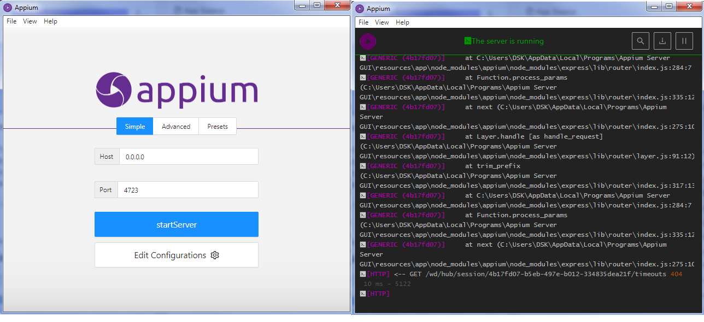

# Automation Tests (mobile automation tests with Appium with using Android Studio (AVD) and real smartphone)

## Technology Stack
|<a href="https://www.jetbrains.com/idea/"></a>  | <a href="https://developer.android.com/studio"></a> |  |  |  |  |  |  |  |  |
|:------------------------------------------------------------------------------------------------------------------:|:------------------------------------------------------------------------------------------------------------------------------:| :---------: |:---------------------------------------------------------------------------------------------------------------------:|:------------------------------------------------------------------------:|:-------------------------------------------------------------------------:|:-------------------------------------------------------------------:|:------------------------------------------------------------------------------------:|:--------------------------------------------------------------------------:|:---------------------------------------------------------------------------:|
|                                                        IDEA                                                        |                                                         Android Studio                                                         | Java |                                                          Git                                                          |                                  JUnite                                  |                               Browserstack                                |                               Appium                                |                                     Rest-Assured                                     |                                   Allure                                   |                                   Jenkins                                   |


## Tests run on real device (with ru locale):


## Tests run with Browserstack (with en locale):


## Allure-report:


## Notes for Run tests:
## For Browserstack
* Create properties file:
> ```src/test/resources/config/browserstack.properties```
>
* Add data:
>```
>deviceName=Google Pixel 3
>platformVersion=9.0
>user=bsuse*****     -- creditials from browserstack account
>key=3Sjd**********  -- creditials from browserstack account
>app=bs://b0532bd2d289a275a8eb997acdabc0f8f2d491e2
>url=http://hub.browserstack.com/wd/hub
>```
* Run tests with command:
> ```./gradlew clean selenide_android_test -Ddevice=browserstack```
## For emulator (with Android Studio AWD)
* Run Android studio:
>a: (More Actions) -> SDK Manager -> Install\check need SDK Platform (for example: Android 11.0)
> 
>b: (More Actions) -> Virtual Device Manager -> Create need device (for example: Pixel_4_API_30) -> Run


* Create properties file:
> ```src/test/resources/config/emulator.properties```
* Add data:
>```
>deviceName=******** - @DefaultValue("Pixel_4_API_30")
>platformName=Android
>platformVersion=**** -  @DefaultValue("11.0")
>app=https://github.com/wikimedia/apps-android-wikipedia/releases/download/latest/app-alpha-universal-release.apk?raw=true
>url=http://localhost:4723/wd/hub
>```
* Run Appium Server on 4723 port
  
* Run tests with command:
> ```./gradlew clean selenide_android_test -Ddevice=emulator```

## For test on real Android device
* Connect smartphone to PC with ADB (use instructions from device vendor for drivers and developer mode, debug via USB..) 
* Check deviceName via adb:
>Use "adb devices" command from %ANDROID_HOME%\platform-tools, for example:
```
...\AppData\Local\Android\Sdk\platform-tools>adb devices
List of devices attached
6hdqkrayaiz9he4l        device
```

* Create properties file:
> ```src/test/resources/config/real.properties```
>
* Add data:
>```
>deviceName=******** - deviceName from adb
>platformName=Android
>platformVersion=**** -  platformVersion from device
>app=https://github.com/wikimedia/apps-android-wikipedia/releases/download/latest/app-alpha-universal-release.apk?raw=true
>url=http://localhost:4723/wd/hub
>```
* Run Appium Server on 4723 port
* Run tests with command:
> ```./gradlew clean selenide_android_test -Ddevice=real```

## Common links:
##### https://www.browserstack.com/
##### https://developer.android.com/studio
##### https://github.com/appium/appium-desktop/releases
##### https://github.com/appium/appium-inspector/releases


